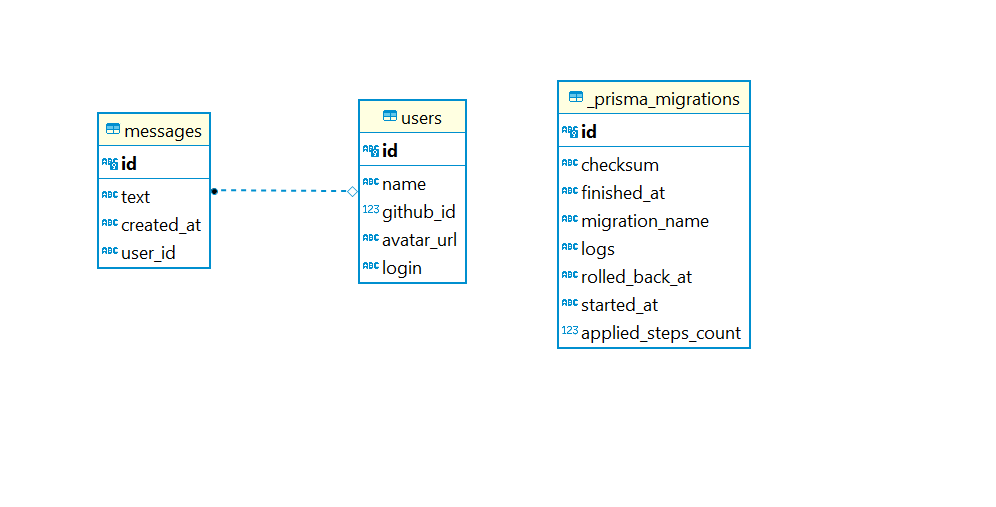

# nlwheat-node

<h4 align="center">
    :computer: Api para registro de messagens em real time, com autenticação github
</h4>

<p align="center">
    <a href="#-projeto">Projeto</a>&nbsp;&nbsp;&nbsp;|&nbsp;&nbsp;&nbsp;
    <a href="#rocket-tecnologias">Tecnologias</a>&nbsp;&nbsp;&nbsp;|&nbsp;&nbsp;&nbsp;
    <a href="#user-content-clipboard-instruções">Instruções</a>&nbsp;&nbsp;&nbsp;|&nbsp;&nbsp;&nbsp;
    <a href="#%EF%B8%8F-comandos-básicos-do-prisma">Migrations</a>&nbsp;&nbsp;&nbsp;|&nbsp;&nbsp;&nbsp;
    <a href="#-gerar-o-build">Build</a>&nbsp;&nbsp;&nbsp;|&nbsp;&nbsp;&nbsp;
    <a href="#%EF%B8%8F-collection-das-requisições---insomnia">Requisições</a>&nbsp;&nbsp;&nbsp;|&nbsp;&nbsp;&nbsp;
    <a href="#-ajustes-e-melhorias">Melhorias</a>
</p>

<div align="center">
    
</div>

---

## 💻 Projeto

API em ExpressJS. Aplicação backend para registro de messagens em real time, com autenticação github.

---

## :rocket: Tecnologias

- [Typescript](https://www.typescriptlang.org/)
- [ExpressJS](https://expressjs.com/pt-br/)
- [Prisma](https://www.prisma.io/)
- [SQLite](https://www.sqlite.org/index.html)
- [Soket.io](https://socket.io/)
- [axios](https://axios-http.com/)
- [jsonwebtoken](https://www.npmjs.com/package/jsonwebtoken)
- [ts-node-dev](https://www.npmjs.com/package/ts-node-dev)

---

## :clipboard: Instruções

### VARIÁVEIS DE AMBIENTE

- Criar na raiz da pasta do projeto um arquivo `.env` e preencher as informações conforme se encontra no arquivo `.env.example`.

### DEPENDÊNCIAS

- No terminal executar o comando para instalar as dependências:

```bash
yarn
```

### MIGRATIONS

- No terminal executar as migrations para criar as tabelas do banco de dados, com o comando:

```bash
yarn prisma migrate dev
```

### START

- Finalizado! Basta agora executar a aplicação backend com o seguinte comando:

```bash
yarn dev
```

- A Api estará rodando na porta conforme definido no arquivo `.env` em PORT, por padrão utilize
  a porta 4000. `http://localhost:4000`

---

## ⚙️ Comandos básicos do prisma

- Configurar um novo projeto Prisma `$ yarn prisma init`

- Gerar artefatos (por exemplo, Prisma Client) `$ yarn prisma generate`

- Navegue pelos seus dados (Exibir o banco de dados pelo navegador) `$ yarn prisma studio`

- Crie migrações do seu esquema Prisma, aplique-as ao banco de dados, gere artefatos (por exemplo, Prisma Client) `$ yarn prisma migrate dev`

- Puxe o esquema de um banco de dados existente, atualizando o esquema Prisma `$ yarn prisma db pull`

- Envie o estado do esquema Prisma para o banco de dados `$ yarn prisma db push`

---

## 📬 Gerar o build

```bash
yarn build
```

---

## ✈️ Collection das requisições - insomnia

- As collections das requisições backend `Collection-Insomnia-nodeheat.json` se econtra dentro da pasta `assets` deste projeto.

---

## 📌 Ajustes e melhorias

O projeto ainda está em desenvolvimento e as próximas atualizações serão voltadas nas seguintes tarefas:

- [ ] Migrar para o banco de dados postgreSQL ou MySQL
- [ ] Configurar para fazer deploy da api
